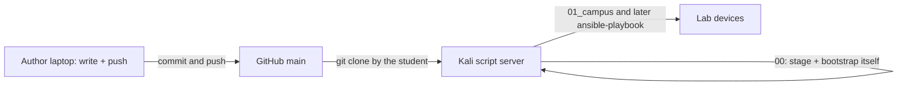
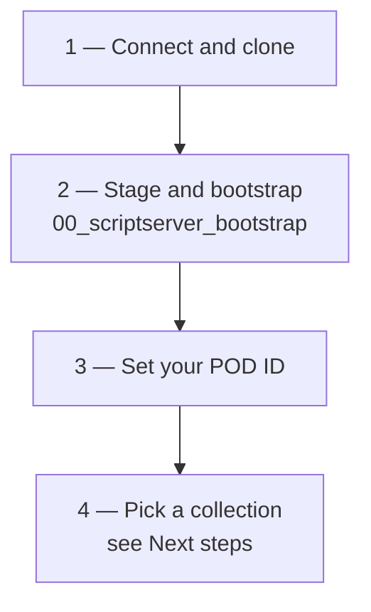

# Cisco One Experience Lab Automation

Ansible collections that automate the dCloud-delivered **Cisco One Experience** (PseudoCo) lab.

Connect **Cisco Secure Client / AnyConnect** to the dCloud session before any SSH, RDP, or playbook run.

## Development workflow

Playbooks are authored on a laptop and published to GitHub. **Everything runs on the Kali script server** — students clone this repository onto that host and bootstrap it from its own checkout. Nothing is installed on the student laptop.



**Authors** work in `ansible-automation/` on a laptop and push to `origin/main`:
https://github.com/imanassypov/cisco-one-experience-lab-automation

**Students** never install anything locally — they clone onto the script server
and run everything there. Start at [Getting started](#getting-started).

## Lab references

- **[Lab user guide](https://imanassypov.github.io/cisco-one-experience-lab-automation/)** — the full student walkthrough, published from [docs/](docs/) by GitHub Pages. The same file opens offline as [docs/index.html](docs/index.html)
- [Lab topology diagram](Lab%20Topology/PseudoCo_Lab_Topology.png)
- [Lab access lookup](Lab%20Topology/PseudoCo_Lab_Access_Lookup.md) — host and URL index. Credentials for all playbooks are vault-encrypted in [lab_access.yml](Lab%20Topology/lab_access.yml)
- [Release notes](release-notes/) — dated summary of what changed and what an operator should do differently. Read the newest file after a `02_sync_from_git.yml` pull.

> **Guide images.** `docs/index.html` was exported from the course platform and
> still points 312 images at a `one_cisco_lab_images/` folder that was never
> committed, so those render broken. The diagrams and screenshots under
> [docs/automation_images/](docs/automation_images/) — every visual in the
> Infrastructure-as-Code sections — resolve normally.

## Collection layout

Playbooks live under `ansible-automation/`. Numbered folders follow lab-build order. Each folder is a self-contained collection.

| Folder | Lab section | Status |
| --- | --- | --- |
| [00_scriptserver_bootstrap](ansible-automation/00_scriptserver_bootstrap/) | Kali Linux script server (`198.18.134.12`) | Implemented |
| [01_campus](ansible-automation/01_campus/) | Campus — [sda](ansible-automation/01_campus/sda/) stub, [evpn](ansible-automation/01_campus/evpn/) in progress | In progress |
| [02_data_center](ansible-automation/02_data_center/) | HQ data center services | Stub |
| [03_dmz](ansible-automation/03_dmz/) | DMZ and Secure Access connector | Stub |
| [04_remote_dc](ansible-automation/04_remote_dc/) | Remote DC / Nexus fabric | Stub |
| [05_sdwan](ansible-automation/05_sdwan/) | SD-WAN fabric and controllers | Stub |
| [06_secure_access](ansible-automation/06_secure_access/) | Cloud SSE / ZTNA / Secure Access | Stub |
| [07_assurance](ansible-automation/07_assurance/) | Assurance — [splunk_evpn](ansible-automation/07_assurance/splunk_evpn/): EVPN streaming telemetry into Splunk (`198.18.5.109`) | Implemented |

## Getting started

New to this project? These steps are the same no matter which collection you
run afterwards. Everything happens on the script server, in one SSH session —
nothing is installed on your laptop.



### 1. Connect the VPN and clone onto the script server

Connect **Cisco Secure Client / AnyConnect** to the dCloud session first —
nothing in the lab is reachable without it. Then:

```bash
ssh cisco@198.18.134.12
git clone https://github.com/imanassypov/cisco-one-experience-lab-automation.git
```

### 2. Stage and bootstrap the box

```bash
cd cisco-one-experience-lab-automation/ansible-automation/00_scriptserver_bootstrap
./stage-script-server.sh
~/venv/bin/ansible-playbook playbooks/00_preflight.yml
~/venv/bin/ansible-playbook playbooks/01_bootstrap_script_server.yml
```

| Step | What it does |
| --- | --- |
| `stage-script-server.sh` | Base packages and the `~/venv` virtualenv with a pinned `ansible-core`. Writes the repo-root `.vault` and prompts once for your **dCloud POD number**. Prompts for `sudo`. |
| `00_preflight.yml` | Read-only. Confirms the checkout is complete, `.vault` decrypts and `sudo` works — before anything is changed |
| `01_bootstrap_script_server.yml` | Lab DNS, OS packages, pinned Cisco collections and SDKs, Genie/pyATS, and `~/venv/bin` on your `PATH` |

Call `ansible-playbook` by **full path** until `01` has finished — putting the
venv on `PATH` is one of the things `01` does. `01` writes that export to your
shell rc files, but the shell you ran it from will not pick it up, because an
already-open shell never re-reads them. Reload it, then confirm:

```bash
exec $SHELL -l
ansible-playbook --version
```

If your shell offers to `apt install ansible-core`, answer **no** — that would
install an unpinned Ansible outside the venv.

Details: [00_scriptserver_bootstrap/README.md](ansible-automation/00_scriptserver_bootstrap/README.md).

### 3. Set your POD ID

Every student runs the same repo against a different pod, so the values that
differ live in one gitignored file, `inventory/group_vars/all/lab.yml`. Today
that file belongs to the campus EVPN collection:

```bash
cd ~/cisco-one-experience-lab-automation/ansible-automation/01_campus/evpn/ansible
grep lab_pod_id inventory/group_vars/all/lab.yml
```

`stage-script-server.sh` already wrote the pod number it prompted you for, so
this is normally a **confirmation, not an edit**. Fix it with
`vi inventory/group_vars/all/lab.yml` if it is wrong or still reads
`REPLACE_ME` — playbooks that need it refuse to run until you do, which is
deliberate: it stops you pushing your SSID (`PSEUDOCO-PODnn`) onto another
student's shared controller.

> **Working directory rule — learn it once.** Ansible reads `ansible.cfg` from
> the **current** directory only, and that file is what points at the inventory,
> the roles, the vars plugin and `.vault`. Always `cd` into a collection's
> `ansible/` directory before running anything. Run from anywhere else and you
> get a missing inventory and interactive password prompts.

### 4. Credentials

You never type a password into a playbook. All lab credentials live
vault-encrypted in [lab_access.yml](Lab%20Topology/lab_access.yml), and the
passphrase lives in the gitignored repo-root `.vault` that the staging script
wrote. A vars plugin decrypts the map and injects it into every play.

---

## Next steps

Work through the collections in this order. Each has its own README that opens
with first-run setup and then serves as the per-stage reference.

| Order | Collection | Start here | Then |
| --- | --- | --- | --- |
| 1 | **Campus EVPN** — builds the BGP EVPN/VXLAN fabric through Catalyst Center, stages 01–12 | [README — Before you begin](ansible-automation/01_campus/evpn/ansible/README.md#before-you-begin) — first-run setup, steps 1–7 | [README — Pipeline order](ansible-automation/01_campus/evpn/ansible/README.md#pipeline-order) — per-stage detail, expected output, troubleshooting |
| 2 | **EVPN assurance with Splunk** — streams fabric telemetry into Splunk and installs the dashboards | [SETUP_GUIDE.md](ansible-automation/07_assurance/splunk_evpn/SETUP_GUIDE.md) — deployment walkthrough | [README.md](ansible-automation/07_assurance/splunk_evpn/README.md) — architecture and reference |

Assurance depends on the fabric being up: the telemetry subscriptions it
consumes are pushed by EVPN stage 10, so run the campus collection first.

Two things in the campus collection are worth knowing before you start:

- **Stage 09 (SWIM) is optional and disruptive.** It upgrades the switches and a
  plain run **reloads them**. It also does nothing until you stage the IOS-XE
  `.bin` files into `iosxe_images/` by hand — they are too large for git. See
  [Stage 09](ansible-automation/01_campus/evpn/ansible/README.md#stage-09--software-image-management-swim).
- **Run the stages one at a time** the first time through, reading each result
  before starting the next. `00_site_deploy.yml` chains all twelve stages once
  you know the pipeline — note that stage 11 blocks for up to ten minutes
  waiting for an access point, and stage 12 fails the run on any mismatch.

The remaining collections in the table above are stubs.

## Picking up later lab fixes

```bash
cd ~/cisco-one-experience-lab-automation/ansible-automation/00_scriptserver_bootstrap
ansible-playbook playbooks/02_sync_from_git.yml
```

It fast-forwards the checkout and fails rather than discarding local edits, so
commit or revert first. Your `lab.yml`, `.vault` and `iosxe_images/` are
gitignored and survive. Check [release-notes/](release-notes/) afterwards for
what changed.
