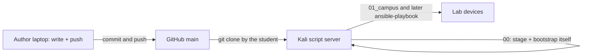

# Cisco One Experience Lab Automation

Ansible collections that automate the dCloud-delivered **Cisco One Experience** (PseudoCo) lab.

Connect **Cisco Secure Client / AnyConnect** to the dCloud session before any SSH, RDP, or playbook run.

## Development workflow

Playbooks are authored on a laptop and published to GitHub. **Everything runs on the Kali script server** — students clone this repository onto that host and bootstrap it from its own checkout. Nothing is installed on the student laptop.



1. **Author on a laptop** in this repo (`ansible-automation/`) and **push to GitHub** (`origin` / `main`): https://github.com/imanassypov/cisco-one-experience-lab-automation
2. **SSH to the script server and clone** (dCloud VPN up):

   ```bash
   ssh cisco@198.18.134.12
   git clone https://github.com/imanassypov/cisco-one-experience-lab-automation.git
   cd cisco-one-experience-lab-automation/ansible-automation/00_scriptserver_bootstrap
   ```
3. **Stage and bootstrap the box from its own checkout.** `stage-script-server.sh` installs the base packages and a virtualenv with `ansible-core`, writes the repo-root `.vault`, and prompts once for your dCloud POD number; collection `00` does the rest — DNS, PATH, collections, SDKs, and Genie/pyATS:

   ```bash
   ./stage-script-server.sh
   ~/venv/bin/ansible-playbook playbooks/00_preflight.yml
   ~/venv/bin/ansible-playbook playbooks/01_bootstrap_script_server.yml
   ```

   Call `ansible-playbook` by full path until `01` has run — that is what puts `~/venv/bin` on `PATH`. To pick up lab changes published later: `ansible-playbook playbooks/02_sync_from_git.yml` (git only).
4. **Run every later collection from the same checkout.** Ansible, collections, and SDKs are already in `~/venv` and on PATH:

   ```bash
   cd ~/cisco-one-experience-lab-automation/ansible-automation/<collection>
   ansible-playbook playbooks/00_....yml
   ```

## Lab references

- [Lab topology diagram](Lab%20Topology/PseudoCo_Lab_Topology.png)
- [Lab access lookup](Lab%20Topology/PseudoCo_Lab_Access_Lookup.md) — host and URL index. Credentials for all playbooks are vault-encrypted in [lab_access.yml](Lab%20Topology/lab_access.yml)

## Collection layout

Playbooks live under `ansible-automation/`. Numbered folders follow lab-build order. Each folder is a self-contained collection.

| Folder | Lab section | Status |
| --- | --- | --- |
| [00_scriptserver_bootstrap](ansible-automation/00_scriptserver_bootstrap/) | Kali Linux script server (`198.18.134.12`) | Implemented |
| [01_campus](ansible-automation/01_campus/) | Campus — [sda](ansible-automation/01_campus/sda/) stub, [evpn](ansible-automation/01_campus/evpn/) in progress | In progress |
| [02_data_center](ansible-automation/02_data_center/) | HQ data center services | Stub |
| [03_dmz](ansible-automation/03_dmz/) | DMZ and Secure Access connector | Stub |
| [04_remote_dc](ansible-automation/04_remote_dc/) | Remote DC / Nexus fabric | Stub |
| [05_sdwan](ansible-automation/05_sdwan/) | SD-WAN fabric and controllers | Stub |
| [06_secure_access](ansible-automation/06_secure_access/) | Cloud SSE / ZTNA / Secure Access | Stub |

## First step — bootstrap the script server

Everything happens on the script server. Do not install Ansible on your laptop.

```bash
ssh cisco@198.18.134.12
git clone https://github.com/imanassypov/cisco-one-experience-lab-automation.git
cd cisco-one-experience-lab-automation/ansible-automation/00_scriptserver_bootstrap
./stage-script-server.sh
~/venv/bin/ansible-playbook playbooks/00_preflight.yml
~/venv/bin/ansible-playbook playbooks/01_bootstrap_script_server.yml
```

See [00_scriptserver_bootstrap/README.md](ansible-automation/00_scriptserver_bootstrap/README.md) for details.
