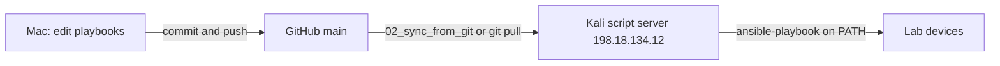

# Cisco One Experience Lab Automation

Ansible collections that automate the dCloud-delivered **Cisco One Experience** (PseudoCo) lab.

Connect **Cisco Secure Client / AnyConnect** to the dCloud session before any SSH, RDP, or playbook run.

## Development workflow

Playbooks are written on the Mac, published to GitHub, and executed on the bootstrapped Kali script server.



1. **Develop locally** in this repo (`ansible-automation/`). Do not author new playbooks on the script server.
2. **Push to GitHub** (`origin` / `main`): https://github.com/imanassypov/cisco-one-experience-lab-automation
3. **Refresh the script server checkout** (VPN up), from the Mac:

   ```bash
   cd ansible-automation/00_scriptserver_bootstrap
   source .venv/bin/activate
   ansible-playbook playbooks/02_sync_from_git.yml
   ```

   That clones or updates `~/cisco-one-experience-lab-automation` on the script server.
4. **Test on the script server** (SSH as `cisco`). Ansible is already on PATH from bootstrap:

   ```bash
   # once per checkout: cp .vault.example .vault  (repo root, gitignored)
   cd ~/cisco-one-experience-lab-automation/ansible-automation/<collection>
   ansible-playbook playbooks/00_....yml
   ```

   You can also `git pull` in that directory instead of running `02_sync_from_git.yml`.

## Lab references

- [Lab topology diagram](Lab%20Topology/PseudoCo_Lab_Topology.png)
- [Lab access lookup](Lab%20Topology/PseudoCo_Lab_Access_Lookup.md) — host and URL index. Credentials for all playbooks are vault-encrypted in [lab_access.yml](Lab%20Topology/lab_access.yml)

## Collection layout

Playbooks live under `ansible-automation/`. Numbered folders follow lab-build order. Each folder is a self-contained collection.

| Folder | Lab section | Status |
| --- | --- | --- |
| [00_scriptserver_bootstrap](ansible-automation/00_scriptserver_bootstrap/) | Kali Linux script server (`198.18.134.12`) | Implemented |
| [01_campus](ansible-automation/01_campus/) | Campus — [sda](ansible-automation/01_campus/sda/) stub, [evpn](ansible-automation/01_campus/evpn/) in progress | In progress |
| [02_data_center](ansible-automation/02_data_center/) | HQ data center services | Stub |
| [03_dmz](ansible-automation/03_dmz/) | DMZ and Secure Access connector | Stub |
| [04_remote_dc](ansible-automation/04_remote_dc/) | Remote DC / Nexus fabric | Stub |
| [05_sdwan](ansible-automation/05_sdwan/) | SD-WAN fabric and controllers | Stub |
| [06_secure_access](ansible-automation/06_secure_access/) | Cloud SSE / ZTNA / Secure Access | Stub |

## First step — bootstrap the script server

Use a **project-local virtualenv** on the Mac (do not install Ansible system-wide):

```bash
cd ansible-automation/00_scriptserver_bootstrap
./setup-local-venv.sh
source .venv/bin/activate
ansible-playbook playbooks/00_preflight.yml
ansible-playbook playbooks/01_bootstrap_script_server.yml
```

See [00_scriptserver_bootstrap/README.md](ansible-automation/00_scriptserver_bootstrap/README.md) for details.
